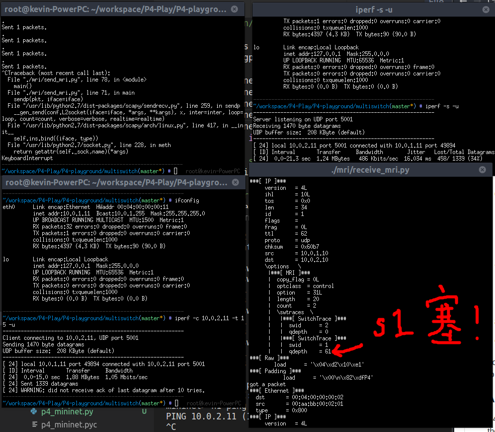
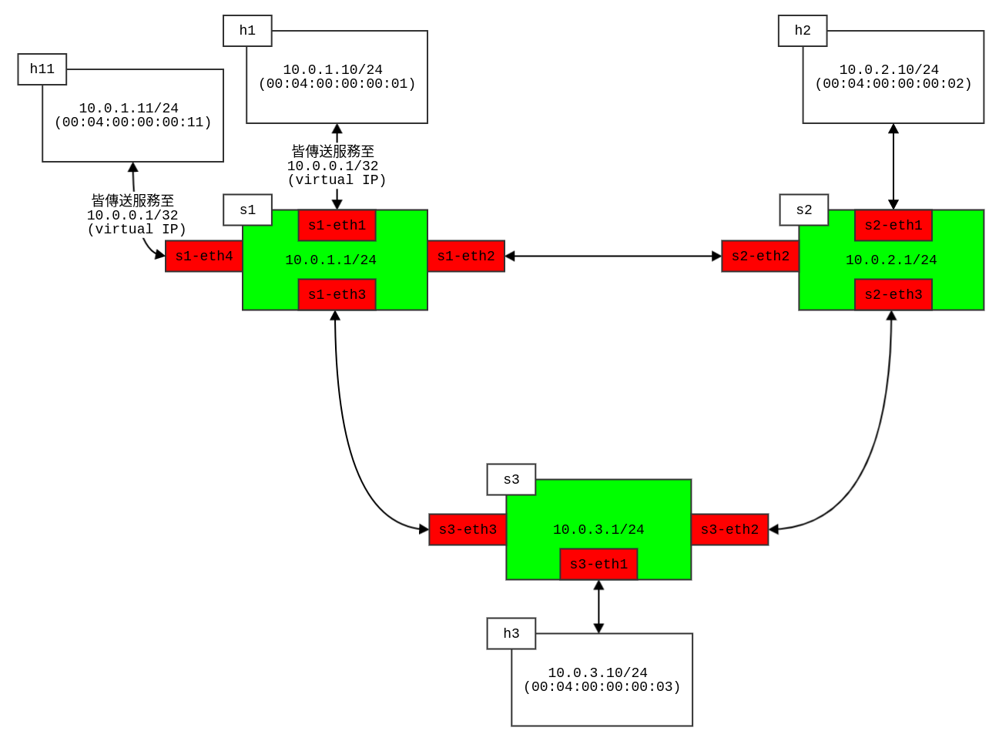
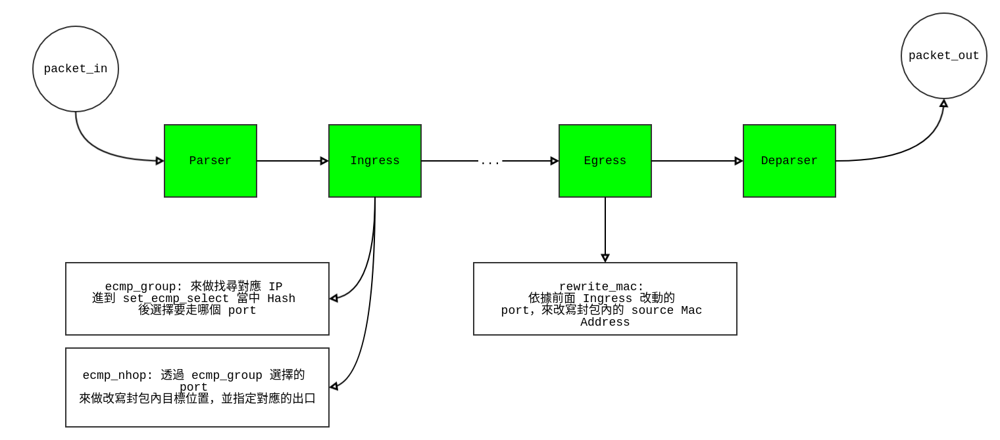
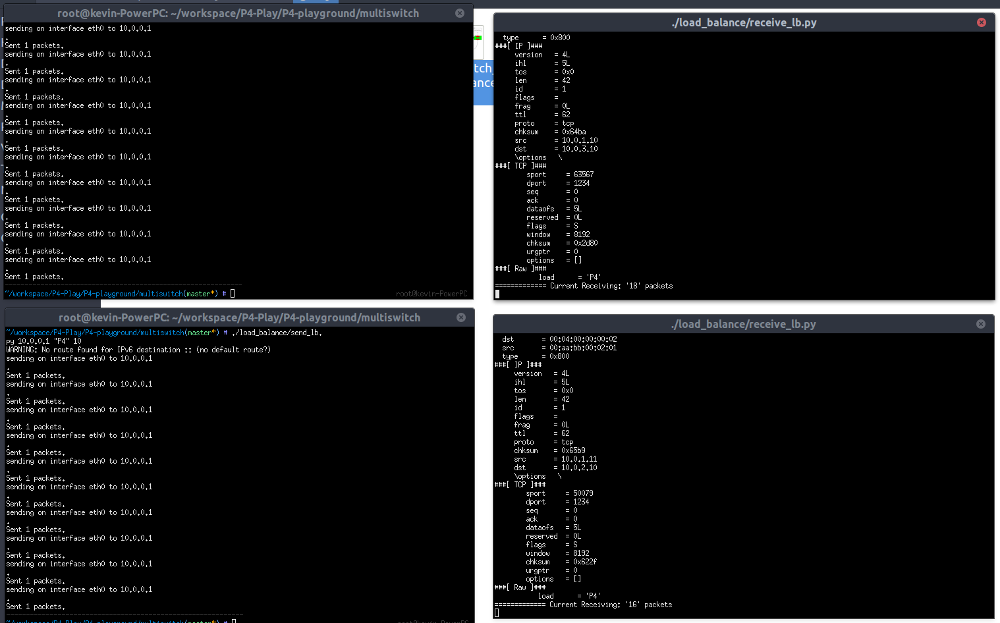

# Multiple Switch Demo

* 重現 SIGCOMM2017 教學、以及一些對 P4 程式的調整使用
* 主要以多個 switch 的模型為主
* [更新] 目前統一把建置的 python 腳本都放置在 `P4-playground/net_build` 資料夾底下，統一透過 `*.sh` 來做呼叫後使用
    * 降低 code size，避免程式碼重複出現
    * 使用 mininet python 來實作 multiple switch 的 topo

## 練習

相關的練習使用，一些異質性高的檔案會放在不同名稱的資料夾當中做使用！

### `basic forwarding` 展示：
* switch 規則放置於 `basic_forwarding/` 底下
    * 可以透過呼叫該目錄底下的 `feed.sh` 來把 table rules 餵給 simple_switch
* 使用 `simple_router.p4` 做為 switch 使用的依據！
* 透過 `build.py` 做運行，透過手動的方式來建立網路 topo
    * 分別3個 switch:
        * `s1`:
            * ip: `10.0.1.1/24`
            * MAC: 
                * `s1-eth1`: `00:aa:bb:00:01:01`
                * `s1-eth2`: `00:aa:bb:00:01:02`
                * `s1-eth3`: `00:aa:bb:00:01:03`
        * `s2`:
            * ip: `10.0.2.1/24`
            * MAC:
                * `s2-eth1`: `00:aa:bb:00:02:02`
                * `s2-eth2`: `00:aa:bb:00:02:01`
                * `s2-eth3`: `00:aa:bb:00:02:03`
        * `s3`:
            * ip: `10.0.3.1/24`
            * MAC:
                * `s3-eth1`: `00:aa:bb:00:03:03`
                * `s3-eth2`: `00:aa:bb:00:03:02`
                * `s3-eth3`: `00:aa:bb:00:03:01`
* 運行範例：
    * 在運行 run_basic.sh 成功後，會進入 mininet CLI 做操作
    * 之後的測試跟之前的範例差不多，單純測試各個 host 間是否成功可以接收！
```bash
# 建立網路
sudo ./run_basic.sh
# (開啟另一個 terminal) 餵入腳本
cd basic_forwarding/ && ./feed.sh
```
* 架構表示：


### `MRI` Multi-hop route inspection 展示

* 進階操作！重現 SIGCOMM2017 當中 MRI 的範例！
    * 修改 P4 Program 做使用（加入額外的 header 來做到 MRI 的操作）
    * 新增 host：`h11`, `h22` 到 basic_forward 的網路模型裡頭
        * 新增的額外這組 host 用來產生大量封包（by `iperf`）
        * 由於使用的和 `h1` 到 `h2` 是同一條 link，所以我們可以在 `h2` 接收端上面看到，每個封包中攜帶的 switch 當下堵塞的狀況！（ `qdepth`）
    * 透過 mininet 提供的功能，來對 link 做 bandwidth 上的修改（讓封包在 `s1` 上產生壅塞）
* 如何使用：
    * 啟動腳本 `run_mri.sh`:
    ```bash
    # change mode
    chmod +x run_mri.sh
    # run !
    sudo ./run_mri.sh
    ```
    * 接著餵規則給目前的3個 switch!
    ```bash
    # change mode
    chmod +x mri/feed.sh
    # run !
    ./mri/feed.sh
    ```
    * 之後便可以進到 `run_mri.sh` 裡頭的 mininet CLI 當中，透過 `xterm h1 h11 h2 h22` 來開啟 4個 terminal 做各自的操作 （**由於操作有些不同，所以要用額外的 send, receive 程式**）
        * `h1` 一般傳送，並傳送 30 秒
            *  `./mri/send_mri.py <h2 IP> "P4" 30`
        * `h2` 一般接收
            *  `./mri/receive_mri.py`
        * `h11` 利用 *iperf* 傳送 udp 封包（沒有壅塞控制的限制）
            * `iperf -c <h22 IP> -t 15 -u`
        * `h22`
            * `iperf -s -u`
* 結果：


### Load balancing 機制實作

* 以 ECMP（*Equal-cost Multi-path* routing）的方法來實作，其機制：
    
    * 為多路徑下的 load balance
    * 並非依照當下 switch queue 的 size，而是單照 Hash function 指定位置來做出口決定
    * 而 hash function 需要用到 5-tuple：
        * `ipv4 header`: 
            * `srcAddr`
            * `dstAddr`
            * `protocol`
        * `tcp header`: (需要用到 tcp 標頭內的資訊，所以 parser 需要對 tcp header 做處理)
            * `srcPort`
            * `dstPort`
    * 流程圖：
    
        * 可以搭配 `load_balance/` 底下的 *.txt 來做理解；這些規則就是搭配 Ingress, Egress 這兩個 control block 來做匹配後使用！
        * 其中在指定的 `ecmp_base` 用來說明 hash function 產生的結果從 0 開始； 而 `ecmp_count` 則是說明到多少； 舉例來說我們傳入 0 2, 0 作為 `ecmp_base` 而 2 作為 `ecmp_count`；則 hash function 則會產生 `0~1` 之間的數值作為 **ecmp_select**，透過 metadata 傳給下一個 table
        * 接著在下一個 table: `next_nhop` 內便依據這個 `ecmp_select` 來看他到底是要從哪個 switch port 出去（使用者設定！）； 而在我自己定義的 scenario 當中，便是 `load_balance/` 底下這些 `*.txt` 內的規則 （可以參考本節一開始的那張圖）； 依據所對應的位置，來匯入到底要改寫到哪個目標！ 接著便可以在 `set_nhop` 的 action 內做改寫 IP/MAC 及出口 port 的動作！
        * 最後再 Egress 的時候，`rewrite_mac` 依據所設定出去的 port，給予改寫 source MAC Address； 從原本的 host MAC 改成 switch 出口 port 的 MAC Address
    * 而 scenario 測試方法，則可以為啟動 2 支程式傳送到 host server: `h2`, `h3` 上面；並透過 server 上 receiver 做接收封包的計數！
    

* 使用方式：
    * 運行 `run_lb.sh` 腳本做建置動作，成功後進入 mininet CLI 當中
    * 之後開啟另一個 terminal，運行:
    ```bash
    cd load_balance/ && chmod +x feed.sh
    # feed the rules to simple_switch
    ./feed.sh
    ```
    * 餵入規則後，可以回到剛才開啟的 mininet CLI 當中，透過 xterm 的方式開啟多個 host:
        * 開啟多個 host 來做等等的實驗內容！
        * 由兩個 host: `h1`, `h11` 啟動後呼叫 `./load_balance/send_lb.py 10.0.0.1 "P4" <呼叫次數>`；與此需要先開啟我們的 server 端： 由另外兩個 host: `h2`, `h3` 來做使用，啟動後呼叫 `./load_balance/receive_lb.py` 做 sniff 的動作，並再每次接收後印出**目前累計的接收數目**
    ```bash
    mininet> xterm h1 h11 h2 h3
    ```
    * 結果如下：
    
* 幾個觀察到的現象：
    * 如果單純一個 for loop 去呼叫 `sendp`，則封包都會到同一個 host 上（無法達到 ecmp 標榜的 load balance 功能）
    * 改成每次 loop 都會重新抓一次 interface 再做傳送，就可以看到 ecmp 的功能