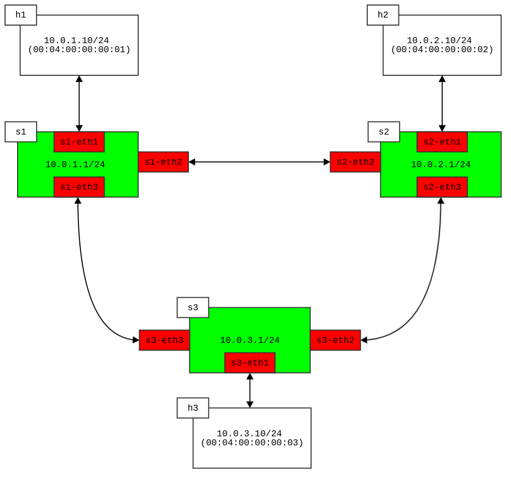

# Multiple Switch Demo

* 重現 SIGCOMM2017 教學、以及一些對 P4 程式的調整使用
* 主要以多個 switch 的模型為主
* 使用 mininet python 來實作 multiple switch 的 topo

## 練習

* 相關的練習使用
    * `basic forwarding` 展示：
        * switch 規則放置於 `basic_forwarding/` 底下
            * 可以透過呼叫該目錄底下的 `feed.sh` 來把 table rules 餵給 simple_switch
        * 使用 `simple_router.p4` 做為 switch 使用的依據！
        * 透過 `build.py` 做運行，透過手動的方式來建立網路 topo
            * 分別3個 switch:
                * `s1`:
                    * ip: `10.0.1.1/24`
                    * MAC: 
                        * `s1-eth1`: `00:aa:bb:00:01:01`
                        * `s1-eth2`: `00:aa:bb:00:01:02`
                        * `s1-eth3`: `00:aa:bb:00:01:03`
                * `s2`:
                    * ip: `10.0.2.1/24`
                    * MAC:
                        * `s2-eth1`: `00:aa:bb:00:02:01`
                        * `s2-eth2`: `00:aa:bb:00:02:02`
                        * `s2-eth3`: `00:aa:bb:00:02:03`
                * `s3`:
                    * ip: `10.0.3.1/24`
                    * MAC:
                        * `s3-eth1`: `00:aa:bb:00:03:01`
                        * `s3-eth2`: `00:aa:bb:00:03:02`
                        * `s3-eth3`: `00:aa:bb:00:03:03`
        * 運行範例：
            * 在運行 run_basic.sh 成功後，會進入 mininet CLI 做操作
            * 之後的測試跟之前的範例差不多，單純測試各個 host 間是否成功可以接收！
        ```bash
        # 建立網路
        sudo ./run_basic.sh
        # (開啟另一個 terminal) 餵入腳本
        cd basic_forwarding/ && ./feed.sh
        ```
        * 架構表示：
        